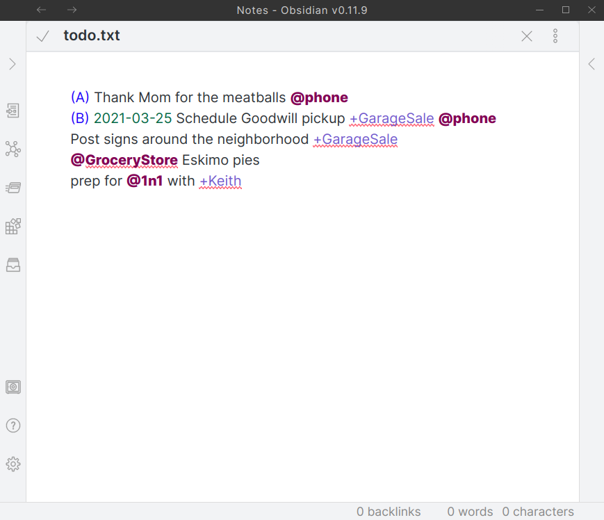

# Obsidian Plugin: Support for todo.txt files

Edit [todo.txt](https://github.com/todotxt/todo.txt) files in Obsidian.

# Installation
Support for 3rd party plugins is enabled in settings (Obsidian > Settings > Third Party plugin > Safe mode - OFF)
To install this plugin, download zip archive from GitHub releases page. Extract the archive into <vault>/.obsidian/plugins.

# Features
- @context is treated as `#tags`
- +Project are treated at `[[Project]]`. You can ctrl click them.
- `_` in +Projects to represent spaces. Ex `+Hello_World`